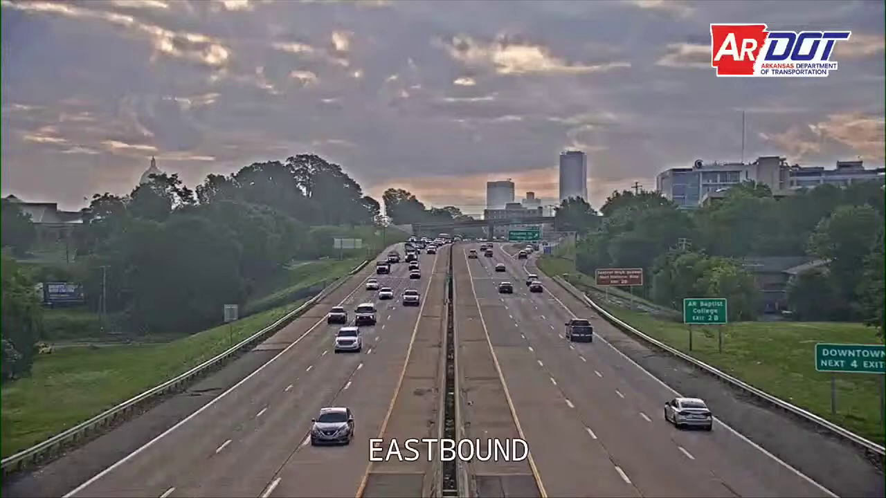

# Contagem de Carros em uma Rodovia

Projeto para realizar a contagem de carros que passam em uma rodovia nos EUA. O código é baseado em uma gravação disponível no YouTube. O objetivo é contar quantos veículos que passaram em cada direção da pista.

Foi utilizado a câmera presente nos primeiros 23 minutos: https://www.youtube.com/watch?v=3uwRHtiyMnI

Os Notebooks estão organizados em etapas de desenvolvimento, mostrando o que foi criado e pensando naquele momento. Pode conter códigos e configurações em Notebooks/códigos mais antigos os quais foram alteradas futuramente.

[Vídeo com todas as explicações contagem carro rodovia](https://youtu.be/IuqxEWSUejA)

## Pré-requisitos
Para executar os códigos e obter os mesmo resultados é necessário baixar o vídeo da gravação da câmera e pegar somente os 23 minutos iniciais, renomeando o vídeo para "camera.mp4".

Para execução dos códigos foi utilizado as seguintes bibliotecas e versões (ou se preferir, pode utilizar o environment.yml do Anaconda disponível no repositório):

- Python == 3.12.9
- Notebook == 7.4.3
- Ultralytics == 8.3.149

## Como rodar
Todas as configurações estão no próprio código e nos respectivos vídeos!

## Autor
* **Programador Artificial** - [GitHub](https://github.com/ProgramadorArtificial) - [YouTube](https://www.youtube.com/@ProgramadorArtificial)
